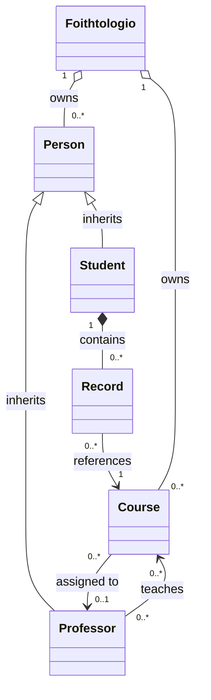

# 🎓 TermiCampus

A terminal-based university registry system written in **C++**, built as a semester assignment. TermiCampus manages students, professors, courses, and grades through a keyboard-navigable ncurses interface, with full CSV persistence across sessions.

---

## 📖 Overview

TermiCampus is a fully object-oriented university registry application that runs entirely inside a terminal. It uses the `ncurses` library to render a navigable menu system with modal pop-up windows for data entry and output display. All registry data — students, professors, courses, and grades — is persisted to and loaded from CSV files.

---

## ✨ Features

| Category | Capability |
|---|---|
| 👥 **Members** | Add / remove / search students and professors by ID |
| 📚 **Courses** | Create courses, assign a responsible professor, link to students |
| 📝 **Grades** | Enroll students in courses, record grades (0.0 – 10.0) |
| 📧 **Notifications** | Simulate bulk email dispatch to all students or all professors |
| 💾 **Persistence** | Save to and load from CSV files (`Students.csv`, `Professors.csv`, `Courses.csv`, `Grades.csv`) |
| 🖥️ **UI** | Arrow-key navigation, modal forms, paginated text viewer — all via ncurses |
| 🛡️ **Safety** | Duplicate detection, null-pointer guards, CSV comma sanitisation, exception handling throughout |

---

## 🏗️ Class Architecture



### 🔗 Relationship Summary

| Relationship | Type | Description |
|---|---|---|
| `Person` → `Student` | Inheritance | Student extends Person with semester and enrolled courses |
| `Person` → `Professor` | Inheritance | Professor extends Person with specialty and taught courses |
| `Student` → `Record` | Composition | Each Student owns their list of Records |
| `Record` → `Course` | Association (ptr) | A Record holds a non-owning pointer to a Course |
| `Professor` → `Course` | Association (ptr) | Professor holds non-owning pointers to courses they teach |
| `Course` → `Professor` | Association (ptr) | Course holds a non-owning pointer to its assigned professor |
| `Foithtologio` → `Person` | Aggregation (owns) | Registry owns all Person* objects; destructor deletes them |
| `Foithtologio` → `Course` | Aggregation (owns) | Registry owns all Course* objects; destructor deletes them |

---

## 📁 Project Structure

```
TermiCampus/
├── main.cpp               # Entry point — ncurses UI, menu loop, form handlers
│
├── Person.hpp / .cpp      # Abstract base class for all members
├── Student.hpp / .cpp     # Student: semester, enrollments, grade records
├── Professor.hpp / .cpp   # Professor: specialty, taught courses
│
├── Course.hpp / .cpp      # Course: code, description, semester, assigned professor
├── Record.hpp / .cpp      # Grade record linking a student to a course + grade
│
├── Foithtologio.hpp / .cpp  # Central registry: owns members & courses, CSV I/O
│
├── Students.csv           # (generated) Persisted student data
├── Professors.csv         # (generated) Persisted professor data
├── Courses.csv            # (generated) Persisted course data
└── Grades.csv             # (generated) Persisted enrollment & grade data
```

---

## 📦 Dependencies

| Dependency | Purpose |
|---|---|
| `ncurses` | Terminal UI — windows, keyboard input, text rendering |
| C++17 standard library | `vector`, `string`, `fstream`, `sstream`, `stdexcept` |

### ⚙️ Installing ncurses

**Debian / Ubuntu:**
```bash
sudo apt install libncurses5-dev libncursesw5-dev
```

**Arch Linux:**
```bash
sudo pacman -S ncurses
```

**macOS (Homebrew):**
```bash
brew install ncurses
```

---

## 🚀 Build & Run

### Compile with g++

```bash
g++ -std=c++17 -o termicampus \
    main.cpp Person.cpp Student.cpp Professor.cpp \
    Course.cpp Record.cpp Foithtologio.cpp \
    -lncurses
```

### Run

```bash
./termicampus
```

> ⚠️ The terminal must support UTF-8 for Greek characters to display correctly. If characters appear garbled, ensure your locale is set:
> ```bash
> export LANG=el_GR.UTF-8
> ```

---

## 🗂️ CSV Data Format

TermiCampus reads and writes four CSV files in the **working directory** of the executable. Commas inside field values are automatically replaced with semicolons on save.

### `Students.csv`
```
<ID>,<Full Name>,<Gender>,<Semester>
25390003,Maria Papadopoulou,Female,8
```

### `Professors.csv`
```
<ID>,<Full Name>,<Gender>,<Specialty>
25390001,Giorgos Meletiou,Male,Programming
```

### `Courses.csv`
```
<Code>,<Title>,<Semester>,<Professor ID | None>
CS101,Object-Oriented Programming,2,25390001
```

### `Grades.csv`
```
<Student ID>,<Course Code>,<Grade>
25390003,CS101,8.5
```

> 💡 If `Grades.csv` does not exist at load time it is silently skipped; all other files are required.

---

## 🎮 Menu Reference

Navigate with **↑ / ↓** arrow keys and confirm with **Enter**.

| Option | Action |
|---|---|
| 1. Load Sample Data | Populates the registry with one sample professor, student, and course |
| 2. Add Student | Interactive form to register a new student |
| 3. Add Professor | Interactive form to register a new professor |
| 4. Create Course | Interactive form to create a course and optionally assign a professor |
| 5. Search Member | Look up any member by their ID and display their full details |
| 6. Email Professors | Simulate sending a notification email to all professors |
| 7. Email Students | Simulate sending a semester update email to all students |
| 8. Save to CSV | Write the current state to all four CSV files |
| 9. Load from CSV | Load persisted data from CSV files and display all members |
| 10. View All Members | Display all registered students and professors |
| 11. Record Grade | Enroll a student in a course (if not already enrolled) and record a grade |
| 12. Exit | Exit the application |

---

## 🧠 OOP Design Decisions

**🔀 Polymorphism via `Person*`**
The registry stores all members as `Person*`. `dynamic_cast` is used to distinguish students from professors at runtime, enabling uniform storage without sacrificing type-specific behaviour.

**📌 Ownership semantics**
`Foithtologio` is the single owner of all heap-allocated `Person` and `Course` objects. Its destructor calls `delete` on every pointer. `Record`, `Professor::taughtCourses`, and `Course::prof` hold non-owning (observing) pointers.

**🧹 Safe removal cascade**
When a `Course` is removed, `Foithtologio::removeCourse` walks all members and calls `removeCourseReference` on each `Student` and `Professor` before deleting the course object — preventing dangling pointers. The same cascade applies when a `Professor` is removed.

**➕ Operator overloading on `Student`**
`operator++` / `operator-=` advance or reduce the student's semester. `operator-` toggles gender. The post-increment `operator++(int)` returns by value (copy), which is the required standard exception to the "pass by reference" rule for post-increment semantics.

**🧼 CSV sanitisation**
`sanitizeCSVField` replaces any literal comma in a string field with a semicolon before writing, preventing row corruption on round-trip save/load.

**🔢 Grade sentinel**
`Record` defaults `grade` to `-1.0f`, used as a sentinel meaning "not yet graded". `hasGrade()` checks for this, and the UI renders `| Grade: -` for ungraded records.
